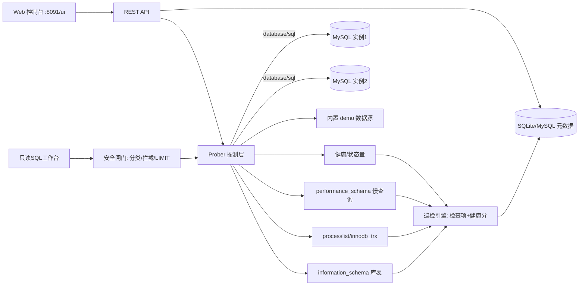

# dba-hub

> 面向 MySQL 的**实例纳管 · 健康巡检评分 · 慢查询分析 · 会话/长事务处置 · 库表容量 · 只读 SQL 工作台**一体化运维平台。
> Go + Gin 单二进制、内嵌 Web 控制台、纯 Go SQLite 零 CGO 依赖；内置 demo 数据源，没有 MySQL 也能秒开演示，配上真实实例即可用于生产。

[](https://go.dev/)
[](LICENSE)

---

## 1. 解决什么问题

DBA / 运维日常面对一堆 MySQL 实例，常见痛点：

- 实例散落在多环境，**没有统一台账**，不知道哪个库归哪个业务、健康度如何；
- 出问题靠人肉 `show status` / `show processlist`，**巡检不成体系、没有评分和历史**；
- 慢查询要登库翻 `performance_schema`，**缺少按累计耗时排序的聚合视图**和全表扫描识别；
- 开发/测试要查数据，直接给账号风险大，需要一个**带安全闸门的只读工作台**（禁写、禁 DDL、禁多语句、自动 LIMIT、全程审计）；
- 无主键表、高碎片表、长事务、主从延迟这些隐患缺少主动发现手段。

dba-hub 把这些收敛到一个平台：



## 2. 功能矩阵

| 模块 | 能力 | 数据来源 |
|---|---|---|
| 实例纳管 | 多环境实例台账、绑定业务/服务树、标签、关键字搜索（课程 M2-14 RDS 资产化） | 元数据库 |
| 健康巡检 | 连接使用率、缓冲池命中率、运行线程、落盘临时表、排序合并、中断连接、主从延迟/线程、长事务、无主键、碎片，**逐项判定并算 0-100 健康分** | SHOW GLOBAL STATUS/VARIABLES、innodb_trx |
| 主从复制 | IO/SQL 线程状态、Seconds_Behind_Master、GTID 自动位点 | SHOW REPLICA/SLAVE STATUS |
| 会话处置 | processlist 查看、**一键 KILL**、长事务（持续时长/锁行/改行数） | information_schema |
| 慢查询 | 从 `events_statements_summary_by_digest` 取 TOP，次数/均耗/峰耗/累计耗时/平均扫描行，**自动标记全表扫描** | performance_schema |
| 库表容量 | 数据/索引/空闲空间、行数、碎片率、**无主键表识别**、大表 TOP | information_schema.tables/statistics |
| SQL 工作台 | 在线只读查询、**EXPLAIN 执行计划**、SELECT 自动补 LIMIT | 目标实例 |
| 安全闸门 | 禁 DDL/写操作、禁多语句夹带、禁 OUTFILE/LOAD_FILE、DELETE/UPDATE 无 WHERE 拦截、**全程操作审计** | 纯规则引擎（有单测） |
| 总览 | 实例数、平均健康分、状态分布、慢查询 TOP、累计巡检次数 | 元数据聚合 |
| 自动巡检 | 可配周期自动跑全部实例并刷新健康分 | 定时任务 |

## 3. 与课程内容的关系（如实说明）

课程主体是大运维平台开发，数据库相关内容是分散的，本项目先**忠实落地课程已有部分**，再补齐生产增量：

| 课程出处 | 课程内容 | 在本项目的落地 |
|---|---|---|
| M2 第14章 | 关系型数据库作为资产：SDK 字段、GORM、增量更新、绑定服务树、表格搜索、tags、RDS 统计 | 实例纳管模块：字段建模、业务/服务树绑定、标签、搜索、总览统计 |
| M8 第2章 | MySQL 性能排查：慢查询、先查索引、Preload/N+1、统计异步缓存、K8s 中 MySQL 调优 | 慢查询 digest 聚合、全表扫描标记、EXPLAIN、无主键/碎片/命中率巡检项 |
| M1 第10章 | 部署 MySQL | docker-compose 内置 MySQL8 演示库 + 初始化脚本 |
| M5 6.4 | 集群外采集数据库字段 | compose 内置 mysqld-exporter + Prometheus + Grafana 主机/实例看板 |

**课程没有、本项目补齐的生产增量**：健康分模型、processlist/KILL、innodb_trx 长事务、performance_schema 慢查询聚合、只读 SQL 安全闸门与审计、主从复制监控、自动巡检与历史、demo 数据源、K8s 清单。

## 4. 快速开始

### 方式一：本地二进制（零依赖，内置 demo）

```bash
CGO_ENABLED=0 go build -o hub ./cmd/hub
./hub                                   # 默认读 configs/config.yaml，没有则用默认配置
# 打开 http://localhost:8091/ui/ ，已自带一个 demo 实例，直接点“巡检”
```

### 方式二：docker compose（平台 + 真实 MySQL8 + exporter + Prometheus + Grafana）

```bash
docker compose up -d --build
```

- 平台：http://localhost:8091/ui/
- Grafana：http://localhost:3000 （admin/admin，已配好 MySQL 看板）
- 在平台「实例纳管 → 新增」填 `host=mysql port=3306 user=root password=example mode=mysql`，即对**真实 MySQL**巡检。

### 方式三：Kubernetes

```bash
kubectl apply -f deploy/k8s/all-in-one.yaml
```

## 5. 一次巡检怎么看

1. 实例列表点「巡检」→ 引擎并发拉取 status/复制/innodb_trx/库表；
2. 输出 0-100 健康分和逐项结果（ok/warn/crit + 当前值 + 处置建议）；
3. 同时给出大表 TOP、无主键表、高碎片表、长事务清单；
4. 结果落库，可看历史曲线；总览页汇总全局健康度与慢查询 TOP。

## 6. HTTP API 速览

| 方法 | 路径 | 说明 |
|---|---|---|
| GET | `/api/v1/instances` | 实例列表（支持 env/kw 过滤） |
| POST/PUT/DELETE | `/api/v1/instances[/:id]` | 实例增改删 |
| POST | `/api/v1/instances/:id/ping` | 连通性/版本探测 |
| POST | `/api/v1/instances/:id/inspect` | 执行全项巡检并落库 |
| GET | `/api/v1/instances/:id/health` | 实时性能快照 |
| GET | `/api/v1/instances/:id/replication` | 主从复制状态 |
| GET | `/api/v1/instances/:id/sessions` | processlist |
| POST | `/api/v1/instances/:id/sessions/:sid/kill` | KILL 会话 |
| GET | `/api/v1/instances/:id/long-txn` | 长事务 |
| GET | `/api/v1/instances/:id/tables` | 库表容量/碎片/主键快照 |
| GET | `/api/v1/instances/:id/slow?n=20` | 慢查询 digest TOP |
| POST | `/api/v1/query` `/explain` | 只读查询 / 执行计划 |
| GET | `/api/v1/query-logs` | SQL 操作审计 |
| GET | `/api/v1/inspections` `/stats` | 巡检历史 / 总览 |

## 7. 目录结构

```
cmd/hub            入口（首启内置 demo 实例、可选自动巡检）
internal/config    配置
internal/model     元数据模型
internal/store     SQLite(纯Go)/MySQL 双驱动
internal/mysqlx    探测层：真实 MySQL + demo 双实现（Prober 接口）
internal/sqlsafe   SQL 安全分类/拦截引擎（含单测）
internal/inspect   巡检引擎：检查项 + 健康分（含单测）
internal/api       REST API
internal/web       go:embed 控制台
deploy             compose 演示库/ exporter / Grafana / K8s
```

## 8. 生产化边界（如实列出）

- **账号最小权限**：平台连接目标库建议用只读监控账号（`PROCESS, REPLICATION CLIENT, SELECT`），KILL 需要额外 `CONNECTION_ADMIN`，按需授予；密码当前明文存元数据库，生产应接 KMS/Vault 或至少加密存储。
- **元数据高可用**：默认 SQLite 单实例，多副本请把平台元数据库切到 MySQL（已内置双驱动）。
- **慢查询依赖**：digest 分析要求目标库开启 `performance_schema`（MySQL 5.7+/8.0 默认开）；传统 slow.log 解析未实现。
- **工作台只读**：刻意不提供写执行通道，结构/数据变更应走工单审批；批量 DDL 建议用 pt-osc/gh-ost。
- **大盘指标**：平台侧重实例巡检与分析，长期趋势指标由 mysqld-exporter + Prometheus + Grafana 承担（compose 已带）。

## 技术栈

Go 1.24 · Gin · GORM · modernc SQLite（纯 Go 无 CGO）· go-sql-driver/mysql · performance_schema · mysqld-exporter · Prometheus · Grafana · Docker Compose · Kubernetes

## License

MIT
